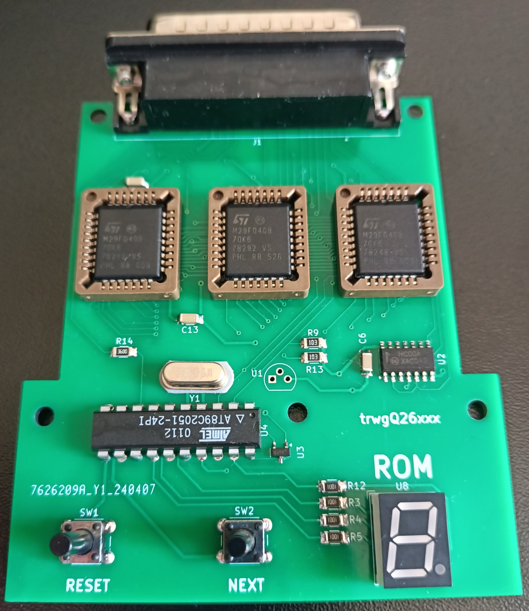
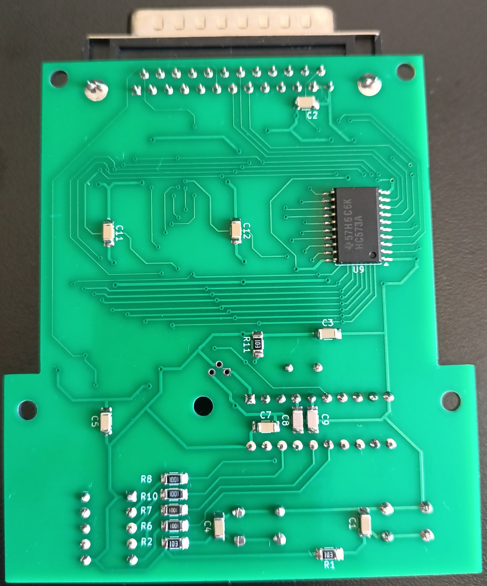
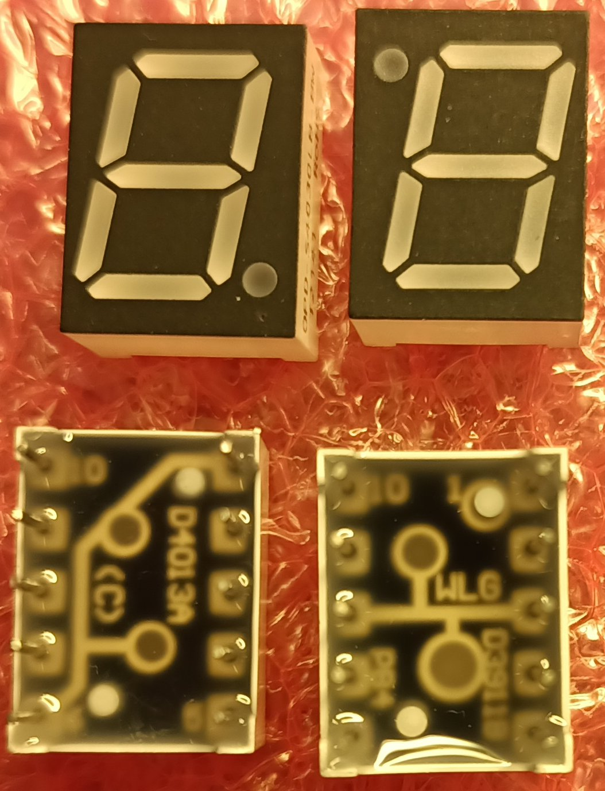

# Disclaimer

Nie wyrażam zgody na wykorzystanie całości bądź części projektu w celach zarobkowych!

# License

Shield: [![CC BY-NC-SA 4.0][cc-by-nc-sa-shield]][cc-by-nc-sa]

This work is licensed under a
[Creative Commons Attribution-NonCommercial-ShareAlike 4.0 International License][cc-by-nc-sa].

[![CC BY-NC-SA 4.0][cc-by-nc-sa-image]][cc-by-nc-sa]

[cc-by-nc-sa]: http://creativecommons.org/licenses/by-nc-sa/4.0/
[cc-by-nc-sa-image]: https://licensebuttons.net/l/by-nc-sa/4.0/88x31.png
[cc-by-nc-sa-shield]: https://img.shields.io/badge/License-CC%20BY--NC--SA%204.0-lightgrey.svg

# Multicart project for Fiat Lancia Tester \ Alfa Romeo Tester \ Check Up 1

Multicart which replaces 8 FLT modules. 8 ROM sets stored in 512kB (4Mbit) FLASH can be switched on the go.

# Directories organization

- **firmware** - AT89C2015 MCU firmware, written in C. Compiled with SDCC version 4.4.0. Can be ported to any 20-pin MCU.
- **merge** - A script that automatically merges up to 8 modules into a single package, loadable onto a multicart.
- **PCB** - PCB project, prepared in KiCad version 8.0.1.
- **DS** - data sheets of used components

# Instructions

Switching modules (ROMs) is accomplished by pressing the BACK and NEXT keys (labeled as RESET and NEXT on the PCB). With each press, a dot lights up on the display for the FLT reset time (approximately 210 ms). The display indicates the number of the currently running module.

The FLASH memories used, of 39SF040 type (or equivalent), have a capacity of 512kB. Considering that the largest FLT modules ROMs are 64kB, I designed the multicart's capacity to accomodate 8 modules. 

# ROMS preparation

The FLASH memory contents can be changed according to the following principles.

**ROM index** | **Base offset**
:---: | :---:
1 | 0x00000
2 | 0x10000
3 | 0x20000
4 | 0x30000
5 | 0x40000
6 | 0x50000
7 | 0x60000
8 | 0x70000

Let's assume we want to load the module at index 3, for which the base offset is 0x20000.

**ROM** | **SIZE** | **The ROM given is PRESENT in the module being loaded at index 3** | **The ROM given is NOT PRESENT in the module being loaded at index 3**
:---: | :---: | :---: | :---:
A | 8kB | Load the content of ROM A into FLASH memory A addresses 0x20000-0x21FFF.Fill addresses 0x22000-0x2FFFF of FLASH memory A with 0xFF. | Fill addresses 0x20000-0x2FFFF of FLASH memory A with 0xFF.
B | 32kB | Load the content of ROM B into FLASH memory B addresses 0x28000-0x2FFFF. Fill addresses 0x20000-0x27FFF of FLASH memory B with 0xFF. | ROM B is always present.
B | 64kB | Load the content of ROM B into FLASH memory B addresses 0x20000-0x2FFFF. | ROM B is always present.
C | 32kB | Load the content of ROM C into FLASH memory C addresses 0x28000-0x2FFFF. Fill addresses 0x20000-0x27FFF of FLASH memory C with 0xFF. | Fill addresses 0x20000-0x2FFFF of FLASH memory C with 0xFF.
C | 64kB | Load the content of ROM C into FLASH memory C addresses 0x20000-0x2FFFF. | Fill addresses 0x20000-0x2FFFF of FLASH memory C with 0xFF.

It should be noted here that the utilization of FLASH memory A is at most 12.5%, as only 8kB of each 64kB bank is utilized. However, I opted for this solution to simplify the process of preparing Flash memory content, given the use of identical offsets.

# Notes

- Only either U1 (TO92) or U3 (SOT23) can be mounted.

- 0.28" LED displays come in two variants. The first variant with common pins 1 and 6, the second variant with common pins 3 and 8. **A display with common pins 1 and 6 should be used in the project**.

