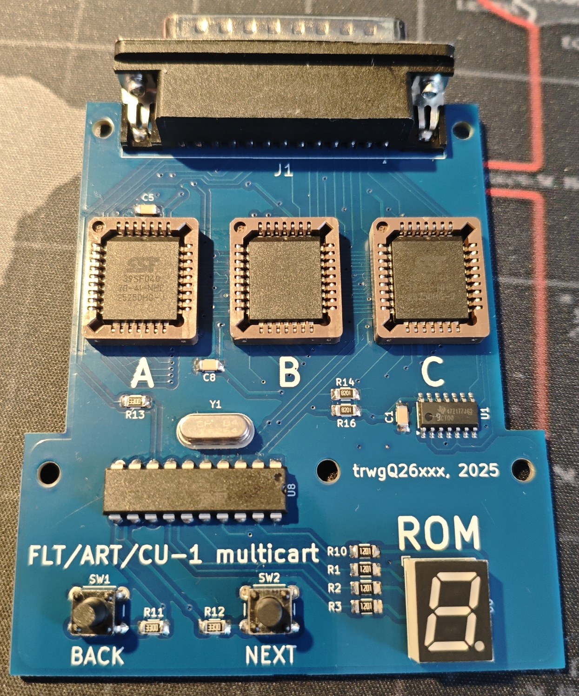
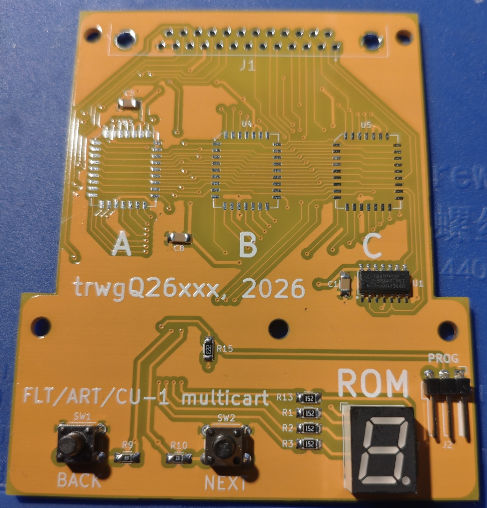
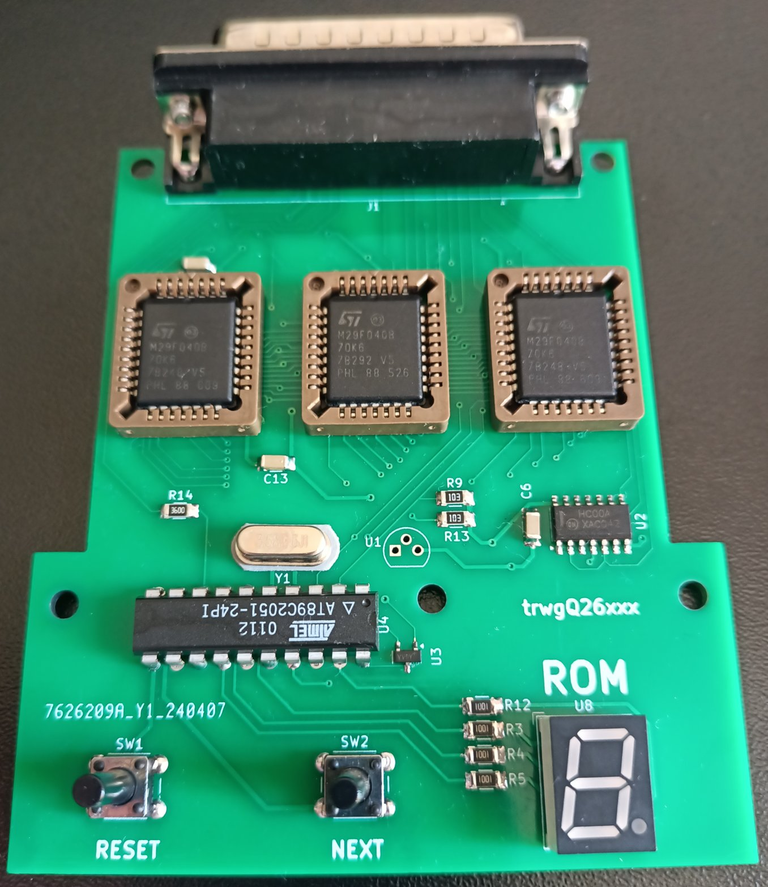
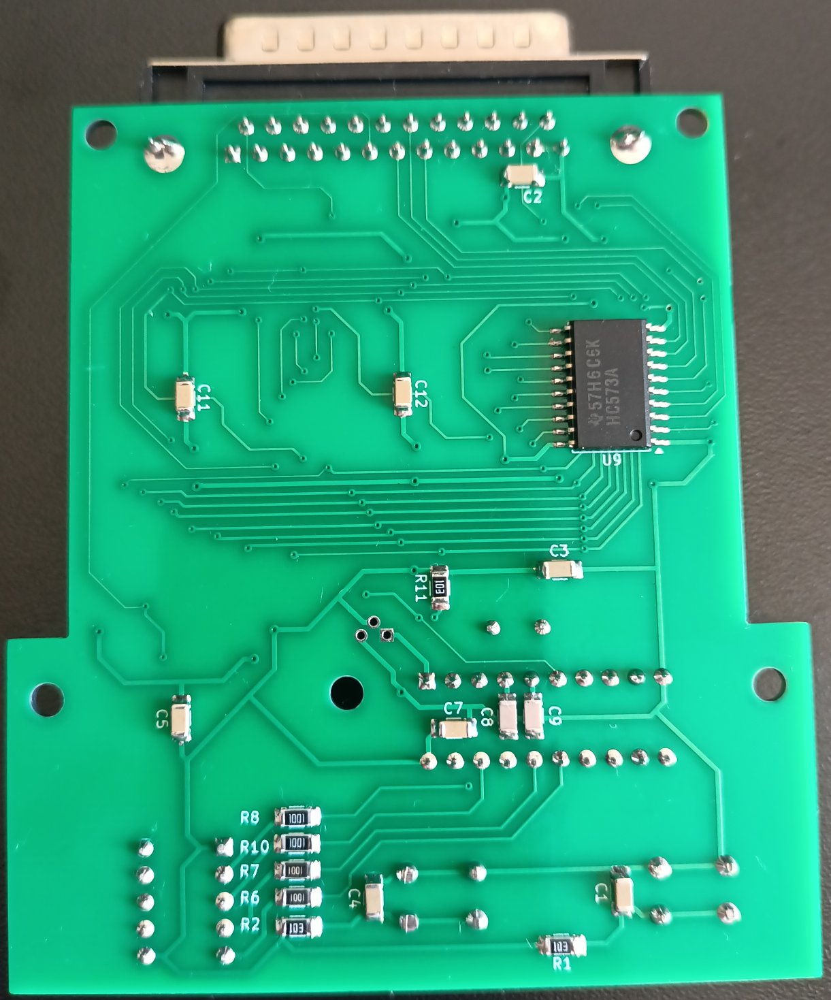
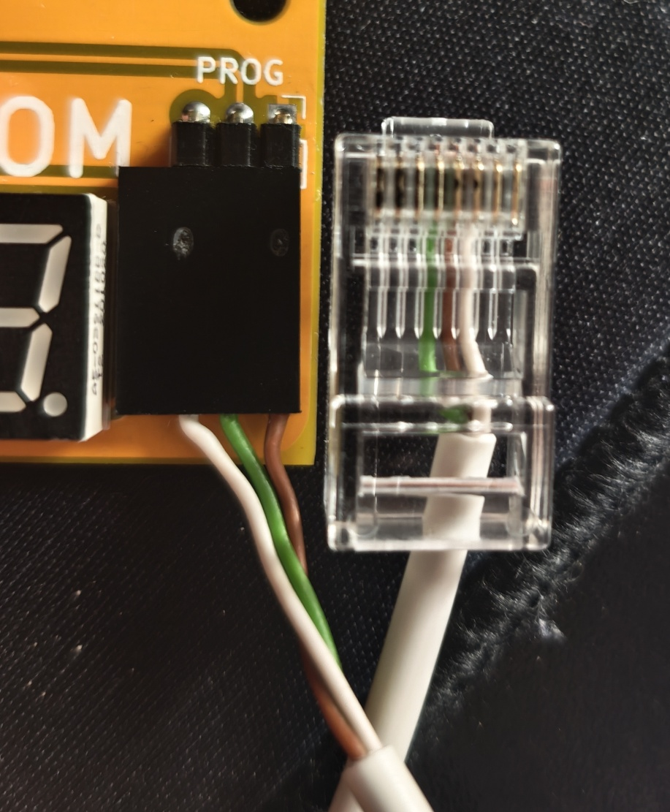
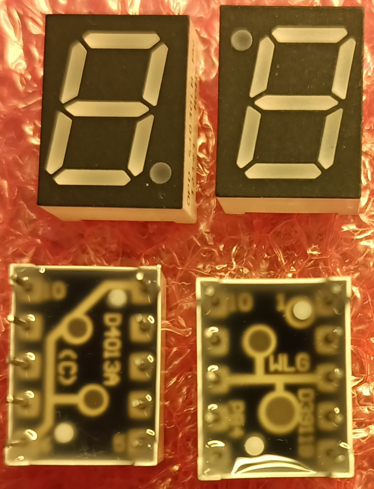

# Multicart ROM module for Fiat Lancia Tester \ Alfa Romeo Tester \ Check Up 1

A multicart ROM module that replaces eight standard FLT modules. It contains eight ROM sets stored in a 512kB (4Mbit) flash memory, which can be switched on the fly.

Two variants are implemented: one using an Atmel AT89C2051 MCU (revisions A and B), and another based on a Microchip ATtiny806 (revision C).

# Disclaimer

I do not consent to the use of all or part of the project for commercial purposes!

Nie wyrażam zgody na wykorzystanie całości bądź części projektu w celach zarobkowych!

# License

Shield: [![CC BY-NC-SA 4.0][cc-by-nc-sa-shield]][cc-by-nc-sa]

This work is licensed under a
[Creative Commons Attribution-NonCommercial-ShareAlike 4.0 International License][cc-by-nc-sa].

[![CC BY-NC-SA 4.0][cc-by-nc-sa-image]][cc-by-nc-sa]

[cc-by-nc-sa]: http://creativecommons.org/licenses/by-nc-sa/4.0/
[cc-by-nc-sa-image]: https://licensebuttons.net/l/by-nc-sa/4.0/88x31.png
[cc-by-nc-sa-shield]: https://img.shields.io/badge/License-CC%20BY--NC--SA%204.0-lightgrey.svg

# Directories organization

- **firmware** - MCU firmware written in C, provided for both the AT89C2051 and ATtiny806 variants.
- **merge** - A script that automatically combines up to eight modules into a single package suitable for loading onto the multicart.
- **PCB** - KiCad PCB project files, available for both the AT89C2051 and ATtiny806 hardware revisions.
- **DS** - Datasheets for all components used in the project.

# Instructions

Switching modules (ROMs) is accomplished by pressing the BACK and NEXT keys. With each press, a dot lights up on the display for the FLT reset time (approximately 200 ms). The display indicates the number of the currently running module.

The FLASH memories used, of 39SF040 type (or equivalent), have a capacity of 512kB. Considering that the largest FLT modules ROMs are 64kB, I designed the multicart's capacity to accomodate 8 modules.

# ROMS preparation

The FLASH memory contents can be changed according to the following principles.

**ROM index** | **Base offset**
:---: | :---:
1 | 0x00000
2 | 0x10000
3 | 0x20000
4 | 0x30000
5 | 0x40000
6 | 0x50000
7 | 0x60000
8 | 0x70000

Let's assume we want to load the module at index 3, for which the base offset is 0x20000.

**ROM** | **SIZE** | **The ROM given is PRESENT in the module being loaded at index 3** | **The ROM given is NOT PRESENT in the module being loaded at index 3**
:---: | :---: | :---: | :---:
A | 8kB | Load the content of ROM A into FLASH memory A addresses 0x20000-0x21FFF.Fill addresses 0x22000-0x2FFFF of FLASH memory A with 0xFF. | Fill addresses 0x20000-0x2FFFF of FLASH memory A with 0xFF.
B | 32kB | Load the content of ROM B into FLASH memory B addresses 0x28000-0x2FFFF. Fill addresses 0x20000-0x27FFF of FLASH memory B with 0xFF. | ROM B is always present.
B | 64kB | Load the content of ROM B into FLASH memory B addresses 0x20000-0x2FFFF. | ROM B is always present.
C | 32kB | Load the content of ROM C into FLASH memory C addresses 0x28000-0x2FFFF. Fill addresses 0x20000-0x27FFF of FLASH memory C with 0xFF. | Fill addresses 0x20000-0x2FFFF of FLASH memory C with 0xFF.
C | 64kB | Load the content of ROM C into FLASH memory C addresses 0x20000-0x2FFFF. | Fill addresses 0x20000-0x2FFFF of FLASH memory C with 0xFF.

It should be noted here that the utilization of FLASH memory A is at most 12.5%, as only 8kB of each 64kB bank is utilized. However, I opted for this solution to simplify the process of preparing Flash memory content, given the use of identical offsets.

# Notes

- Use the APX810-40SA as the reset supervisor for the AT89C2051 MCU (U7 on the PCB) in revisions A and B.

- Wiring the MPLAB ICD5 8P8C Connector to the Multicart PROG Connector (Revision C):

**SIGNAL** | **PROG pin** | **8P8C pin**
:---: | :---: | :---:
GND | 1 | 5
UPDI | 2 | 4
VCC | 3 | 6

- 0.28" LED displays are available in two pinout variants. The first variant uses common pins 1 and 6. The second variant uses common pins 3 and 8. **Revisions B and C of the project require the display with common pins 3 and 8.** The version with common pins 1 and 6 was used only in revision A.

