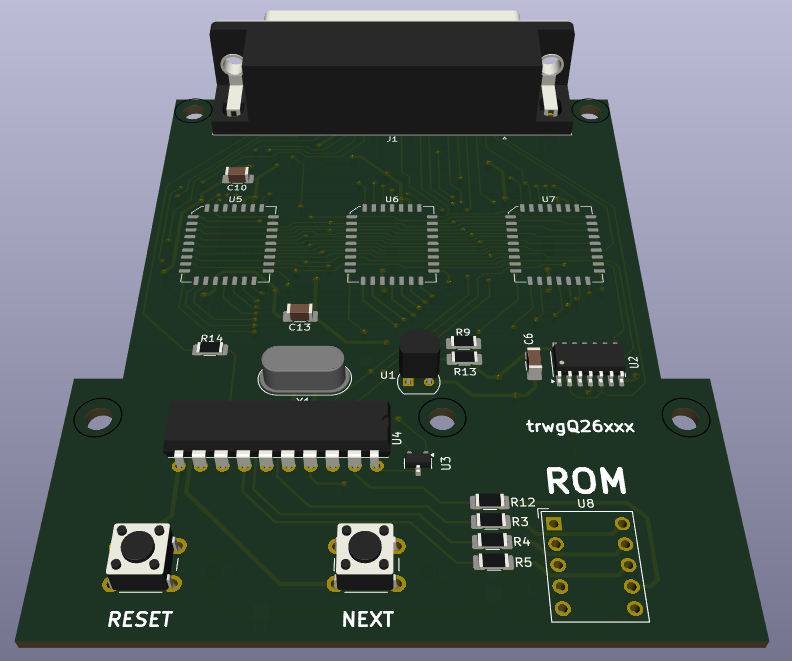

# Multicart project for Fiat Lancia Tester \ Alfa Romeo Tester \ Check Up 1

Multicart which replaces 8 FLT modules. 8 ROM sets stored in 512kB (4Mbit) FLASH can be switched on the go.

# Directories organization

- **firmware** - AT89C2015 MCU firmware, written in C. Compiled with SDCC version 4.4.0. Can be ported to any 20-pin MCU.
- **PCB** - PCB project, prepared in KiCad version 8.0.1.
- **DS** - data sheets of used components

# ROMS preparation

ROM index | Offset
:---: | :---:
1 | 0x00000
2 | 0x10000
3 | 0x20000
4 | 0x30000
5 | 0x40000
6 | 0x50000
7 | 0x60000
8 | 0x70000
